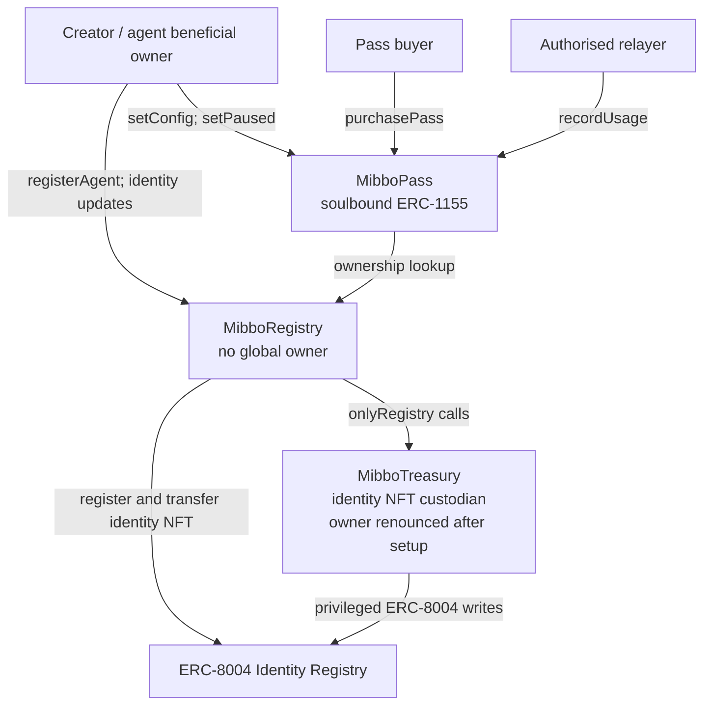
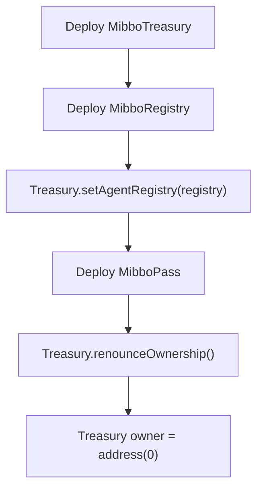

# Mibboverse v2 core architecture

The core consists of `MibboRegistry`, `MibboTreasury`, and `MibboPass`. `MibboSettlement` is a separate optional x402 payment component; see [x402 settlement](x402-settlement.md).

For diagrams and the public contract surface, see the [contract overview](contracts-overview.md).

## Trust boundaries



### MibboRegistry

Registry records an immutable-in-practice beneficial owner for each newly registered `agentId`. It has no `Ownable` inheritance or global administrator. The agent beneficial owner alone may update that agent's ERC-8004 metadata and URI through the Registry.

Registry's ERC-8004 and Treasury addresses are constructor immutables.

### MibboTreasury

Treasury owns the ERC-8004 identity NFT after registration and is the sole component that calls ERC-8004's privileged wallet, metadata, and URI functions. `onlyRegistry` permits those Treasury functions only for the configured Registry.

`AgentEcosystem` configures the Registry and then calls `renounceOwnership()`. The owner becomes `address(0)`, so the trusted Registry cannot subsequently be changed. This trust-minimising finalisation is part of the standard v2 deployment, not an optional post-deployment operation.

### MibboPass

MibboPass is a soulbound ERC-1155. An ERC-1155 `tokenId` equals `agentId`, so marketplace metadata resolution uses the standard `uri(agentId)` interface.

- The beneficial owner creates a versioned pass configuration via `setConfig`.
- A config contains payment token, full subscription fee, duration, request limit, pause state, and a metadata URI.
- `purchasePass` sends the entire fee directly to `MibboRegistry.getAgentOwner(agentId)`.
- A purchase replaces the buyer's previous pass for the same agent.
- Each purchased pass stores its own expiry, quota counters, and config version in `UserPassState`.
- `recordUsage` is restricted to the MibboPass relayer allowlist and rejects a missing, paused, expired, or quota-exhausted pass.

`MibboPass` ownership is deliberately retained after deployment because its owner manages the relayer allowlist. Use a secure governance account or multisig for this role, and use dedicated low-balance relayer wallets.

## Agent lifecycle

1. The creator signs the ERC-8004 `AgentWalletSet` typed data for the next agent ID, naming Treasury as the NFT owner.
2. The creator calls `MibboRegistry.registerAgent`.
3. Registry registers the ERC-8004 identity NFT and transfers it to Treasury.
4. Registry calls `MibboTreasury.initAgent`; Treasury verifies NFT custody and calls ERC-8004 `setAgentWallet`.
5. Registry records the creator as `beneficialOwner` and emits `AgentRegistered`.

The identity NFT and reputation cannot be transferred by the creator because Treasury retains custody. The beneficial owner is an on-chain registry record used for authorisation and payment routing.

## Pass lifecycle and metadata

1. An agent beneficial owner calls `MibboPass.setConfig(agentId, cfg)`.
2. The call creates a new configuration version and stores its metadata URI with that version.
3. A buyer approves the configured ERC-20 and calls `purchasePass(agentId)`.
4. MibboPass mints one soulbound ERC-1155 token with `tokenId == agentId` and stores user-specific state.
5. An authorised relayer calls `recordUsage` as off-chain requests are consumed.

The current ERC-1155 URI is available through `uri(agentId)`. Historical config URIs remain readable through `getConfigURI(agentId, version)`. Changing a configuration affects future purchases; pausing the current config immediately makes `hasAccess` false for all holders of that agent's pass.

## Deployment finalisation



`MibboSettlement` is not deployed by this module and must be deployed separately when required.

## Test coverage

The v2 test suite covers agent registration and NFT custody, beneficial-owner metadata updates, Treasury `onlyRegistry` restrictions, ownership finalisation, soulbound passes, pass configuration versioning and URIs, fee routing, quota/expiry/pause enforcement, and x402 settlement authorisation.

```powershell
npx hardhat test test/MibboRegistry.test.ts test/MibboTreasury.test.ts test/MibboPass.test.ts test/integration.test.ts test/MibboSettlement.test.ts
```
