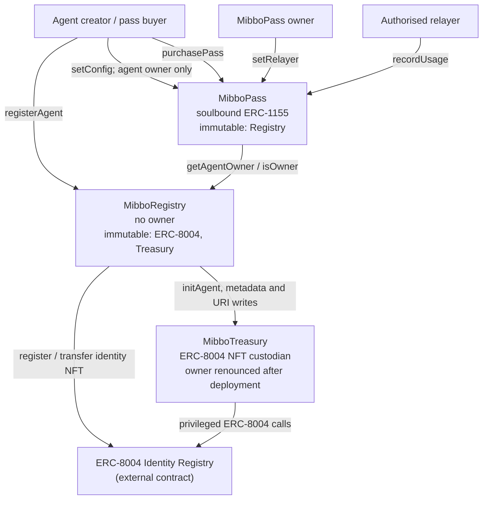
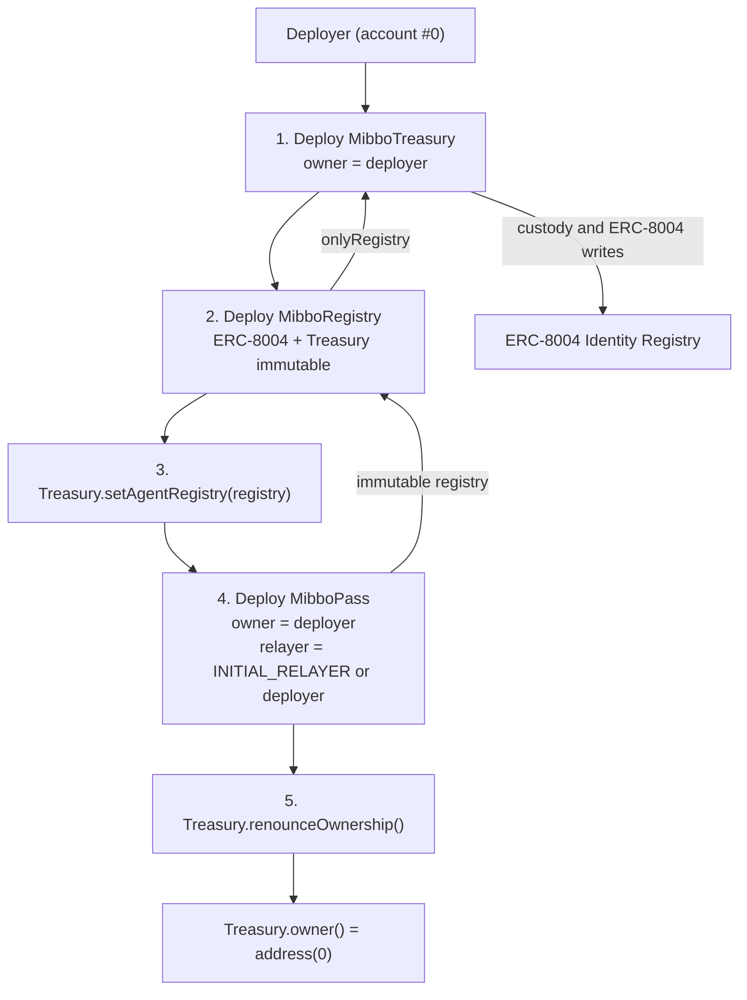
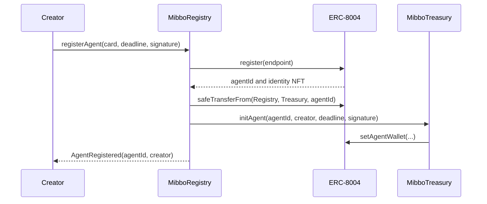
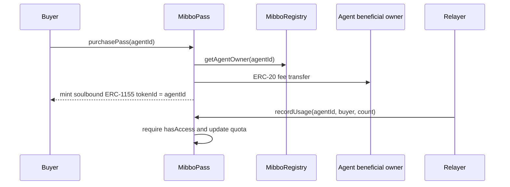

# Contract architecture: MibboRegistry · MibboTreasury · MibboPass

> `MibboSettlement` is intentionally independent of this ecosystem stack. See [x402 settlement](x402-settlement.md).

## 1. Contract relationships

| Relationship | Enforcement | Meaning |
|---|---|---|
| `MibboRegistry → ERC-8004` | `immutable` | Registry registers identity NFTs and reads agent wallets. |
| `MibboRegistry → MibboTreasury` | `immutable` | Registry forwards custody and privileged identity operations to Treasury. |
| `MibboTreasury → ERC-8004` | `immutable` | Treasury is the custodian and executes privileged ERC-8004 calls. |
| `MibboTreasury ← MibboRegistry` | `onlyRegistry` | Only the configured Registry can initialise agents or update their ERC-8004 metadata. The Ignition deployment finalises this binding by renouncing Treasury ownership. |
| `MibboPass → MibboRegistry` | `immutable` | Pass verifies agent ownership and sends subscription fees to the beneficial owner. |
| `MibboPass → relayers` | `onlyOwner` allowlist | The Pass owner can add or remove relayers that record usage. |

## 2. Deployment flow

`AgentEcosystem` makes `renounceOwnership()` depend on both Registry configuration and Pass deployment, so it is the final deployment action. If the Registry binding is not configured, Treasury rejects all privileged Registry calls.

## 3. Contracts and public responsibilities

### MibboRegistry

**Role:** The central agent registry. It maps `agentId` to the permanent beneficial owner, registers agents, and is the owner-authorisation layer for identity metadata changes. It does not custody the ERC-8004 NFTs itself.

| Function | Caller | Behaviour |
|---|---|---|
| `registerAgent(card, deadline, sig)` | Anyone | Registers an ERC-8004 identity, transfers its NFT to Treasury, initialises the agent wallet, and records the caller as beneficial owner. |
| `updateAgentMetadata(agentId, key, value)` | Agent beneficial owner | Forwards a metadata update through Treasury to ERC-8004. |
| `updateAgentURI(agentId, newURI)` | Agent beneficial owner | Forwards an identity URI update through Treasury to ERC-8004. |
| `getAgentOwner(agentId)` | Anyone | Returns the beneficial owner. |
| `getAgentInfo(agentId)` | Anyone | Returns beneficial owner, ERC-8004 agent wallet, and creation timestamp. |
| `getAgentsByOwner(owner)` | Anyone | Returns all agent IDs registered by an owner. |
| `isOwner(agentId, account)` | Anyone / MibboPass | Checks beneficial ownership. |

### MibboTreasury

**Role:** Custody for ERC-8004 identity NFTs. It is the only contract that performs privileged ERC-8004 writes, and accepts those calls solely from the configured MibboRegistry.

| Function | Caller | Behaviour |
|---|---|---|
| `setAgentRegistry(address)` | Owner, before finalisation | Sets the Registry authorised to use Treasury. The Ignition module subsequently renounces ownership. |
| `initAgent(agentId, wallet, deadline, sig)` | MibboRegistry | Confirms NFT custody and writes the agent wallet in ERC-8004. |
| `updateMetadata(agentId, key, value)` | MibboRegistry | Calls `erc8004.setMetadata()`. |
| `updateAgentURI(agentId, newURI)` | MibboRegistry | Calls `erc8004.setAgentURI()`. |

### MibboPass

**Role:** A soulbound ERC-1155 access-pass system. Each `agentId` is an ERC-1155 token ID. A purchase transfers the full configured fee to the agent beneficial owner; the pass itself tracks its purchaser-specific expiry, request quota, and configuration version.

| Function | Caller | Behaviour |
|---|---|---|
| `setConfig(agentId, cfg)` | Agent beneficial owner | Creates a new config version containing payment token, fee, duration, request limit, pause state, and metadata URI. |
| `setPaused(agentId, paused)` | Agent beneficial owner | Pauses or resumes the current configuration. |
| `purchasePass(agentId)` | Anyone | Collects the full fee for the beneficial owner, replaces an existing pass for that agent, and mints a soulbound ERC-1155 pass. |
| `hasAccess(user, agentId)` | Anyone / relayer | Returns true only for a held, unpaused, unexpired pass with unused request quota. |
| `recordUsage(agentId, user, count)` | Authorised relayer | Records consumption only while `hasAccess` is true. |
| `setRelayer(address, status)` | Pass owner | Adds or removes a usage relayer. |
| `getPassStatus(user, agentId)` | Anyone | Returns access state, expiry, quota use, and the purchased config version. |
| `getUserPasses(user)` / `getActivePasses(user)` | Anyone | Returns all recorded or currently active agent passes. |
| `getCurrentConfig(agentId)` / `getConfig(agentId, version)` | Anyone | Returns the current or a historical configuration version. |
| `getConfigURI(agentId, version)` / `uri(agentId)` | Anyone | Returns a historical configuration URI or the current ERC-1155 metadata URI. |

## 4. Core flows

### Agent registration

### Pass purchase and usage

## 5. Post-deployment mutability

| Item | Contract | Authority | Change |
|---|---|---|---|
| Agent beneficial owner | MibboRegistry | None | Immutable after registration. |
| ERC-8004 address | MibboRegistry / MibboTreasury | None | Constructor `immutable`. |
| Treasury address | MibboRegistry | None | Constructor `immutable`. |
| Registry address | MibboTreasury | None after Ignition finalisation | Set during deployment, then Treasury ownership is renounced. |
| Pass Registry address | MibboPass | None | Constructor `immutable`. |
| Pass configuration and metadata URI | MibboPass | Agent beneficial owner | `setConfig(agentId, cfg)`. |
| Current pass pause state | MibboPass | Agent beneficial owner | `setPaused(agentId, paused)`. |
| Usage relayer allowlist | MibboPass | Pass owner | `setRelayer(address, status)`. |

## 6. Invariants

- ERC-8004 identity NFTs are held by MibboTreasury, not by their creators.
- Only MibboRegistry can trigger Treasury's privileged ERC-8004 operations.
- MibboRegistry has no global owner or administrator.
- MibboPass tokens cannot be transferred between non-zero addresses.
- A relayer cannot record usage for a missing, paused, expired, or quota-exhausted pass.
- A configuration URI is versioned with its pass configuration; `uri(agentId)` exposes the latest version through the ERC-1155 standard.
